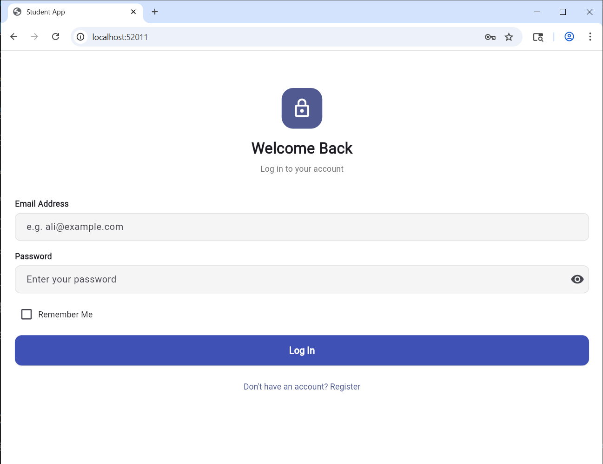

# Flutter Project – Multi-Screen App

**Student:** Ayesha Khalid  
**ID:** se221024


---

## 📱 Project Overview
This Flutter project demonstrates a multi-screen application with registration, login, dashboard, and detail screens.  
The app runs without errors and follows best practices in Flutter development.

---

## 📂 Project Structure
lib/
├── main.dart              ← App entry point & theme  
├── models/                ← Data models (User, Subject, Gender)  
├── controllers/           ← Business logic (AuthController)  
├── validators/            ← Form validation rules  
├── widgets/               ← Reusable UI components  
└── screens/               ← App screens (Registration, Login, Dashboard, Detail)  

---

## 📸 Screenshots

### Registration Screen


### Verificatio Screen


### Gender Selection


### Login Screen


### Dashboard


  

---

## 🛠 How to Run
1. Clone the repository:
   ```bash
   git clone https://github.com/ayeshakhalid25/flutter_project.git
