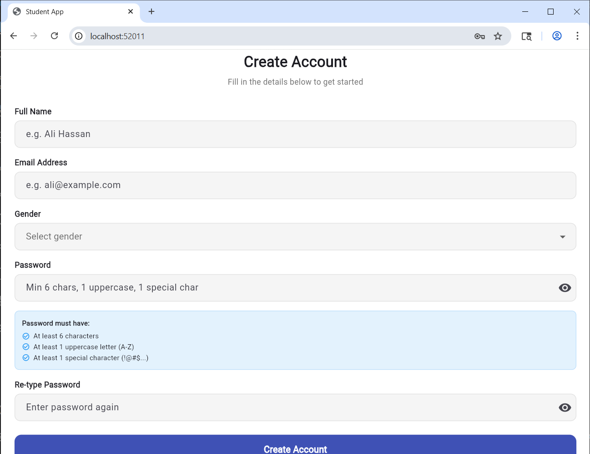
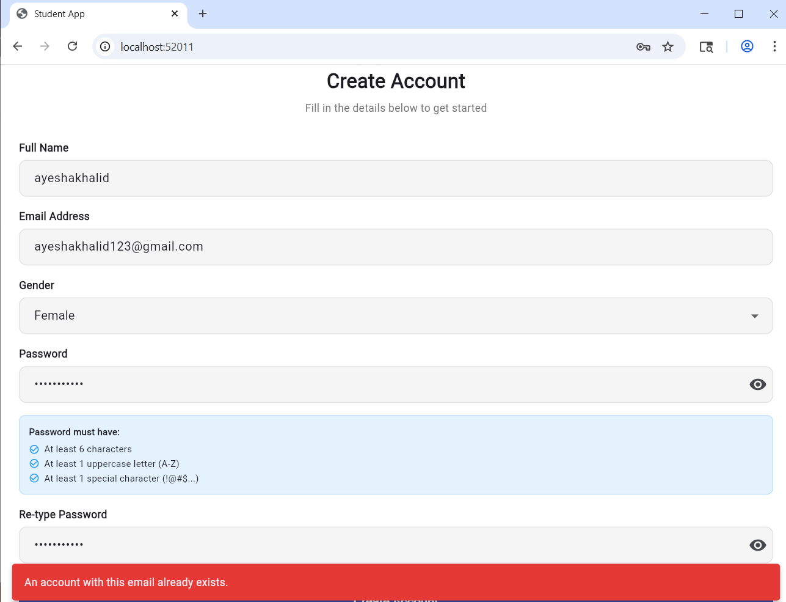
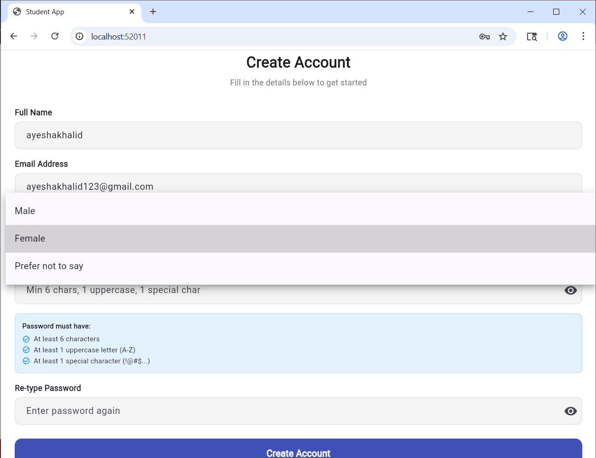
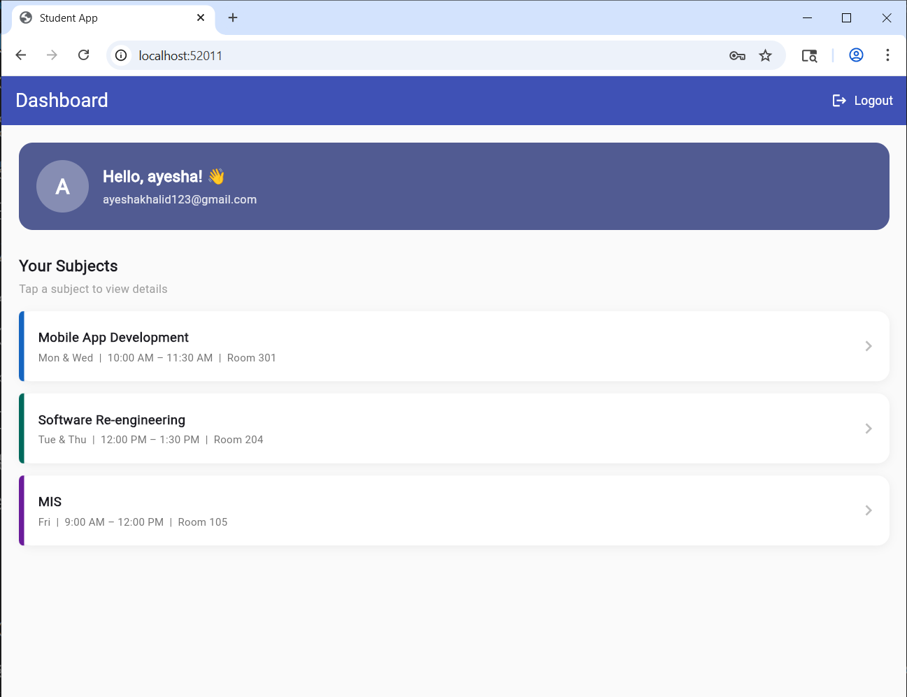
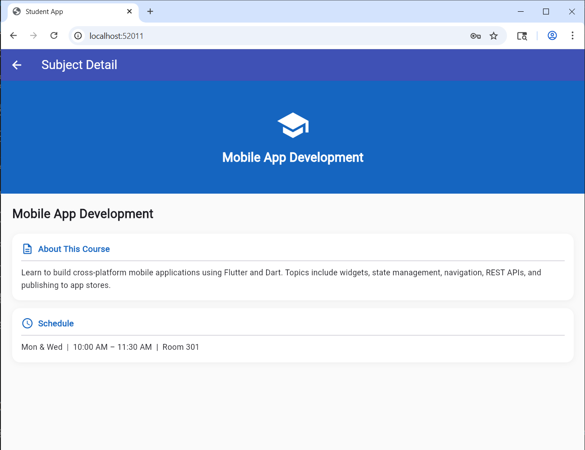
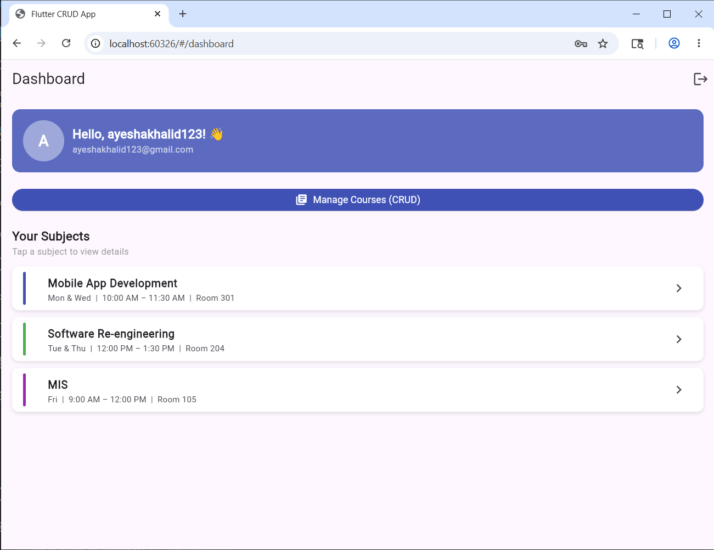
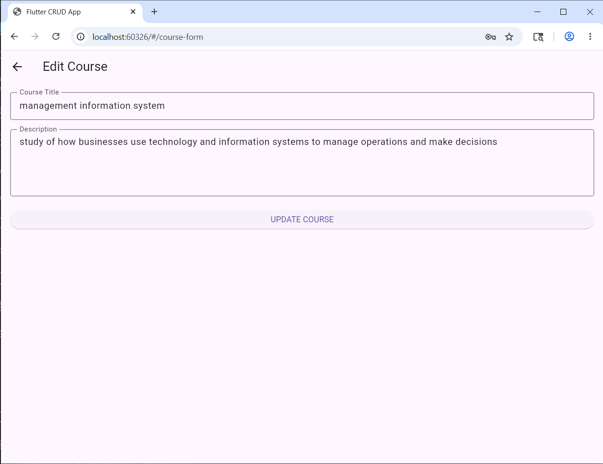
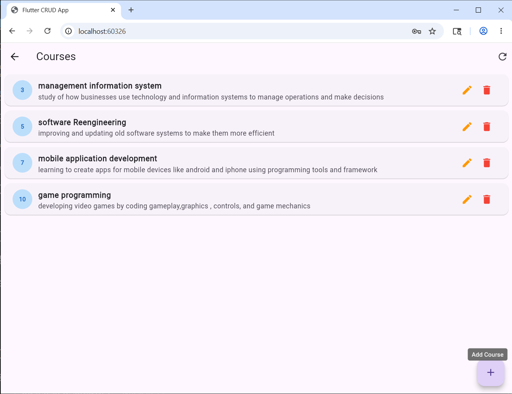
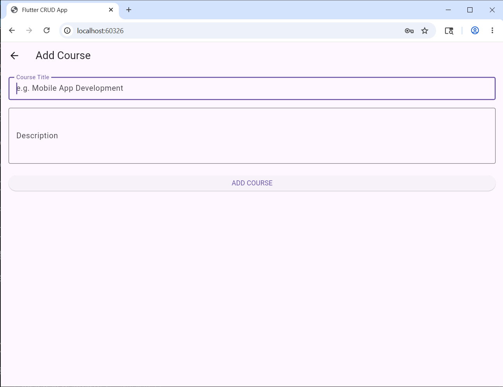
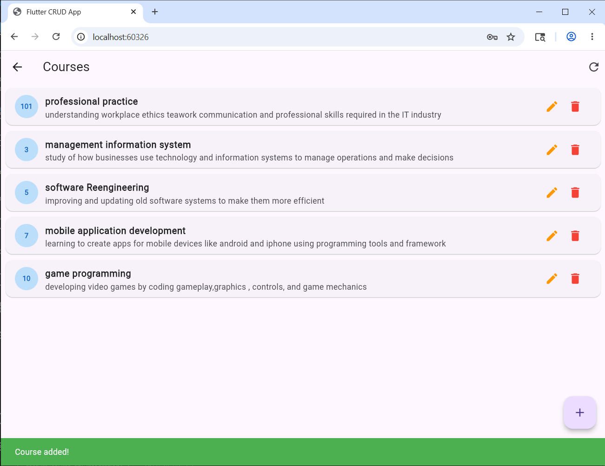

# Flutter Multi-Screen App — Course API Integration

## Branch
`feature/course-api-integration`

---

## API Used
**JSONPlaceholder** — Free fake REST API for testing and prototyping.  
Endpoint used: `https://jsonplaceholder.typicode.com/posts`  
Each post is treated as a course (fields: id, userId, title, body).

## Documentation Followed
https://jsonplaceholder.typicode.com/guide

---

## CRUD Features Implemented

| Operation | HTTP Method | Endpoint | Description |
|---|---|---|---|
| Read | GET | `/posts` | Fetch and display list of courses |
| Create | POST | `/posts` | Add a new course |
| Update | PUT | `/posts/{id}` | Edit an existing course |
| Delete | DELETE | `/posts/{id}` | Delete a course with confirmation |

---

## Screenshots

## 📸 Screenshots

### Registration Screen


### Login Screen


### Dashboard



### Extra Screens




### manage courses


### edit course



### Course added




---

## Project Structure

```
lib/
├── main.dart                        ← App entry point & routes
├── enums.dart                       ← ApiState enum
├── api_services.dart                ← All API calls (GET, POST, PUT, DELETE)
├── models/
│   ├── gender.dart                  ← Gender enum
│   ├── subject.dart                 ← Subject model + data
│   ├── user.dart                    ← UserModel
│   └── course_model.dart            ← Course model (fromJson / toJson)
├── controllers/
│   └── auth_controller.dart         ← Register / login business logic
├── validators/
│   └── app_validator.dart           ← All form validation rules
├── widgets/
│   └── custom_text_field.dart       ← Reusable input field widget
└── screens/
    ├── registration_screen.dart     ← Screen 1 — Register
    ├── login_screen.dart            ← Screen 2 — Login
    ├── dashboard_screen.dart        ← Screen 3 — Dashboard
    ├── detail_screen.dart           ← Screen 4 — Subject Detail
    ├── course_list_screen.dart      ← Screen 5 — Course List (CRUD)
    └── course_form_screen.dart      ← Screen 6 — Add / Edit Course
```

---

## Architecture

- `api_services.dart` — All HTTP calls live here, never in UI screens (service layer)
- `controllers/` — Business logic separated from UI
- `validators/` — Reusable form validation class
- `models/` — Data models with fromJson / toJson methods
- `enums.dart` — ApiState (idle, loading, success, error) for state handling

---

## State Handling

Every API call goes through 3 states:

| State | What happens |
|---|---|
| `loading` | Shows a `CircularProgressIndicator` |
| `success` | Shows the data / updates the UI |
| `error` | Shows error message with a retry button |

---

## App Flow

```
Registration Screen
       ↓  (on success)
  Login Screen
       ↓  (on success)
 Dashboard Screen
       ↓  (tap subject)           ↓  (tap Manage Courses)
  Detail Screen              Course List Screen
       ↓  (back)                  ↓  (tap +)        ↓  (tap edit)
 Dashboard Screen           Add Course Form     Edit Course Form
       ↓  (logout)
  Login Screen
```

---

## Original Assignment Requirements

| Requirement | File | Status |
|---|---|---|
| Registration form (name, email, gender, password) | registration_screen.dart | ✅ |
| Email validation | app_validator.dart | ✅ |
| Password rules (6 chars, uppercase, special char) | app_validator.dart | ✅ |
| Confirm password matching | app_validator.dart | ✅ |
| Gender dropdown (enum-based) | gender.dart | ✅ |
| Login with email + password | login_screen.dart | ✅ |
| Password show/hide toggle | login_screen.dart | ✅ |
| Remember Me checkbox | login_screen.dart | ✅ |
| Dashboard with user info + avatar | dashboard_screen.dart | ✅ |
| Subject list (MAD, SRE, MIS) | subject.dart | ✅ |
| Tap subject → Detail screen | dashboard_screen.dart | ✅ |
| Detail screen (header, banner, desc, schedule) | detail_screen.dart | ✅ |
| Logout → back to Login | dashboard_screen.dart | ✅ |
| Custom Validator class | app_validator.dart | ✅ |
| Enum implementation | gender.dart | ✅ |
| Controller layer (separate from UI) | auth_controller.dart | ✅ |

## Extension Assignment Requirements (CRUD)

| Requirement | File | Status |
|---|---|---|
| Fetch courses from API (GET) | api_services.dart | ✅ |
| Show loading indicator | course_list_screen.dart | ✅ |
| Handle error states | course_list_screen.dart | ✅ |
| Add course via API (POST) | api_services.dart | ✅ |
| Update UI after add | course_list_screen.dart | ✅ |
| Edit course via API (PUT) | api_services.dart | ✅ |
| Pre-fill form with existing data | course_form_screen.dart | ✅ |
| Delete course via API (DELETE) | api_services.dart | ✅ |
| Confirmation dialog before delete | course_list_screen.dart | ✅ |
| Separate service layer for API calls | api_services.dart | ✅ |

---

## How to Run

1. Make sure Flutter is installed: https://flutter.dev/docs/get-started/install
2. Open a terminal in the project folder
3. Run:

```bash
flutter pub get
flutter run
```